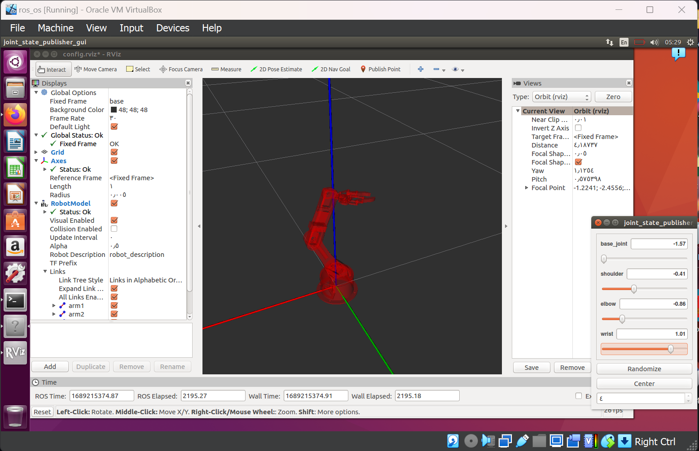
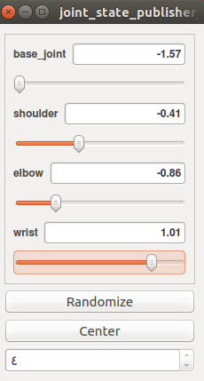

# Robot Arm
install ROS melodic by VirtualBox and Ubuntu, apply robotic arm in ROS
## Set up
we set up a robot arm in ROS (Robot Operating System), following these steps:
 **1.** Begin by downloading VirtualBox, a virtualization program that enables us to run Ubuntu on our computer inside a virtual machine.

 **2.** Install Ubuntu 18.04: Once we have VirtualBox installed, download and install Ubuntu 18.04 as the operating system for our virtual machine.

 **3.** Open the Terminal: After booting into Ubuntu, we open the Terminal application, which allows us to execute commands.

 **4.** Add ROS repository: Add the ROS repository to the package manager's list of software sources by running the following command in the **Terminal:**
sudo sh -c 'echo "deb http://packages.ros.org/ros/ubuntu $(lsb_release -sc) main" > /etc/apt/sources.list.d/ros-latest.list'

 **5.** Add ROS key: Import the ROS key to verify the authenticity of the packages by executing this command:
sudo apt-key adv --keyserver 'hkp://keyserver.ubuntu.com:80' --recv-key C1CF6E31E6BADE8868B172B4F42ED6FBAB17C654

 **6.** Update packages: Update the package manager's list of available packages by running the following command:
sudo apt-get update

 **7.** Install ROS Kinetic: Install the ROS Kinetic Desktop Full package by executing this command:
sudo apt-get install ros-kinetic-desktop-full

 **8.** Configure environment: Set up the ROS environment variables by adding the following line to the end of the ~/.bashrc file:
echo "source /opt/ros/kinetic/setup.bash" >> ~/.bashrc
source ~/.bashrc

 **9.** Install additional dependencies: Install additional dependencies required for ROS by executing these commands:
sudo apt install python-rosdep python-rosinstall python-rosinstall-generator python-wstool build-essential
sudo apt install python-rosdep
sudo rosdep init
rosdep update

 **10.** Install catkin: Install the catkin package, which is used for building ROS packages, by running the following command:
sudo apt-get install ros-noetic-catkin

 **11.**	Create a workspace: Create a catkin workspace by executing these commands:
mkdir -p ~/catkin_ws/src
cd ~/catkin_ws/
catkin_make

 **12.**	Clone the robot arm package: Navigate to the src directory of the workspace and clone the robot arm package from the GitHub repository:
cd ~/catkin_ws/src
git clone https://github.com/smart-methods/arduino_robot_arm.git

 **13.**	Install package dependencies: Install the dependencies for the robot arm package using the following command:
cd ~/catkin_ws
rosdep install --from-paths src --ignore-src -r -y

 **14.**	Install MoveIt and Gazebo packages: Install MoveIt and Gazebo packages, which provide motion planning and simulation capabilities, by running these commands:
sudo apt-get install ros-kinetic-moveit
sudo apt-get install ros-kinetic-joint-state-publisher ros-kinetic-joint-state-publisher-gui
sudo apt-get install ros-kinetic-gazebo-ros-control joint-state-publisher
sudo apt-get install ros-kinetic-ros-controllers ros-kinetic-ros-control

 **15.**	Modify bashrc file: Open the ~/.bashrc file in a text editor using the following command:
sudo nano ~/.bashrc

 **16.**	Add workspace sourcing: At the end of the bashrc file, add the following line to source the workspace:
source /home/Lujain/catkin_ws/devel/setup.bash

 **17.**	Save and exit: Press Ctrl + O to save the file and Ctrl + X to exit the text editor.

 **18.**	Update bashrc: Update the bashrc file by sourcing it using the following command:
source ~/.bashrc

 **19.**	Launch the robot arm: Finally, launch the robot arm by running the following command:
roslaunch robot_arm_pkg check_motors.launch

**By following these steps, we will set up the necessary environment and launch the robot arm in ROS for further exploration and control. That will appear as follows:** 

 With the following parameters, we may control this Arm:
 

